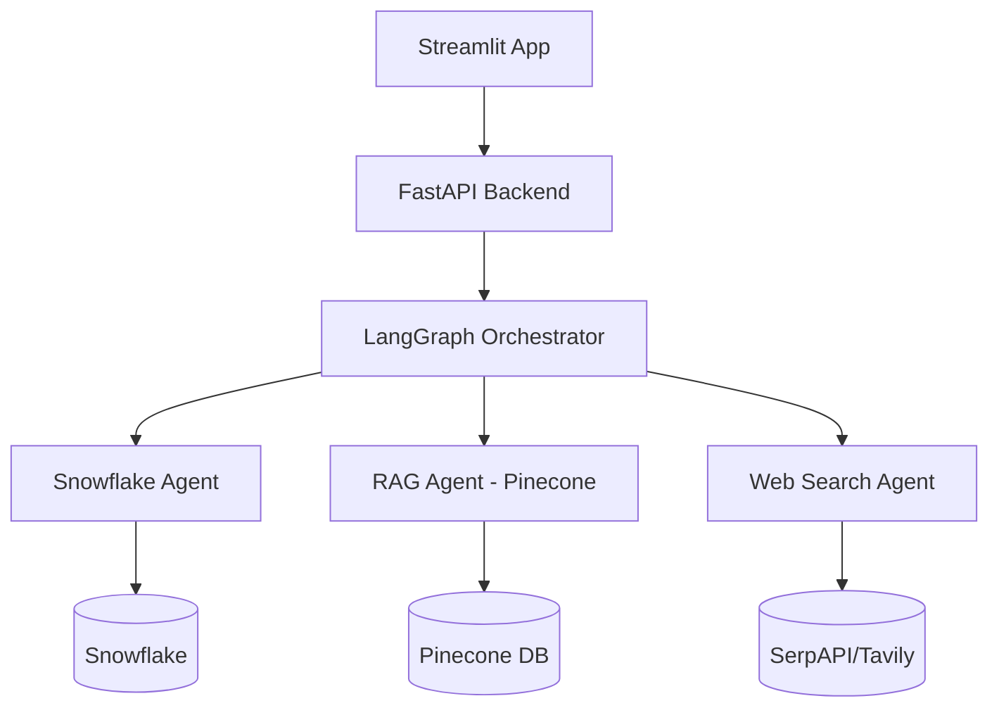

# MiniManus
An AI Research Assistant

# 📊 NVIDIA Multi-Agent Research Assistant

This project is a multi-agent Research Assistant that intelligently consolidates **structured**, **unstructured**, and **real-time** data using:

- **Snowflake** (Valuation Measures)
- **RAG pipeline with Pinecone** (Quarterly NVIDIA Reports)
- **Web Search APIs** (SerpAPI)

It is built using **LangGraph**, **FastAPI**, and **Streamlit**, and deployed using **Docker**.

> ✨ Inspired by LangGraph demos and dreams of AI agents bickering over who’s smarter.

---

## 🚀 Features

- 🔍 **Ask NVIDIA research questions**
- 📅 **Filter responses by Year & Quarter**
- 📈 **Generate charts and summaries**
- 🌐 **Get real-time insights from the web**
- 🧠 **Powered by LangGraph agents**
  - **Snowflake Agent** – Queries structured valuation data
  - **RAG Agent** – Retrieves semantically relevant content from quarterly reports (Pinecone with metadata)
  - **Web Agent** – Fetches live news and trends

---

## 📦 Tech Stack

| Component         | Tech Used                     |
|------------------|-------------------------------|
| Frontend         | Streamlit                     |
| Backend API      | FastAPI                       |
| Agent Orchestration | LangGraph                 |
| Vector DB        | Pinecone                      |
| Structured DB    | Snowflake                     |
| Real-Time Data   | SerpAPI                       |
| Deployment       | Docker                        |

---

## 🏗️ Architecture



---

### 3. Build & Run with Docker

```bash
docker-compose up --build
```

> App will be accessible at: `[http://localhost:8501](http://3.130.104.76:8501)`

---

## 🧪 Usage

1. Upload or select a **NVIDIA quarterly report**
2. Choose **year and quarter**
3. Ask your research question
4. Choose response type:
   - 📘 RAG Agent
   - 📊 Snowflake Agent
   - 🌍 Web Agent
   - 🤖 All Agents (Combined)

---

## 📄 Project Structure

```
.
├── backend/               # FastAPI app
├── frontend/              # Streamlit UI
├── agents/                # LangGraph multi-agent orchestration
├── pinecone/              # Vector indexing and hybrid search logic
├── snowflake/             # Structured data handling
├── web_search/            # Real-time search integration
├── docker-compose.yml
├── requirements.txt
├── README.md
└── AIUseDisclosure.md
```

---

## 📹 Demo Video

> 📽️ [Watch 5-minute demo](https://link-to-demo.com)

---

## 🔗 Deployed Application

> 🌐 [Live App]([https://your-deployment-link.com](http://3.130.104.76:8501))

---

## 👥 Team Contribution

- Member 1: Snowflake + Docker Setup
- Member 2: Pinecone RAG + LangGraph
- Member 3: Web Agent + UI

All members contributed equally (33%).

---

## 📘 AIUseDisclosure.md

This project uses:

| Tool      | Purpose                              |
|-----------|--------------------------------------|
| GPT-4     | Text summarization, QA               |
| Pinecone  | Vector search                        |
| SerpAPI   | Real-time news & trend retrieval     |
| LangGraph | Multi-agent orchestration            |

We ensured ethical use of AI tools following course and institutional guidelines.
